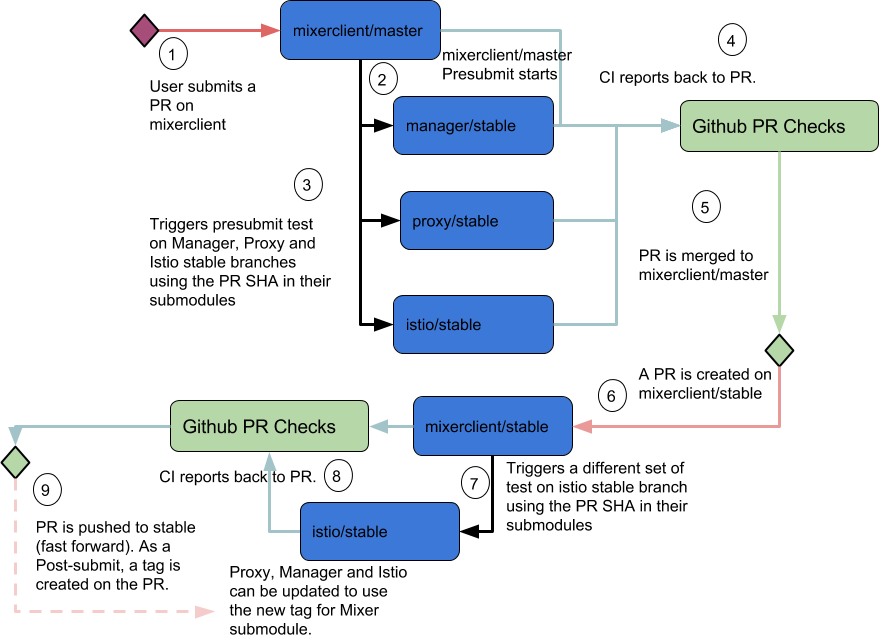

# Istio Test Infra #

## Testing Infrastructure ##
More details [here](doc/deployment.md).
## Tests Types ##

* Unit tests: Should be done in specific modules for features implemented in a module. (PR to master)
* Integration tests: Each module should write integration tests that exercises their dependencies. Integration tests should be runnable by every contributors locally and should not need access to a cluster. Those tests will also be run when PR are created on dependencies. Integration testing is the team responsibility and therefore will not be planned in this document. (PR to master)
* Long Integration tests: Longer integration tests (>10 minutes) might only be triggered for qualification. (PR master to stable)
* End to end tests: Stored in istio/istio module where all components need to be tested together. (PR to master and PR master to stable)
* Performance Benchmarks: Benchmarks should be kept in modules. (PR master to stable)
* Performance Regression: Stored in istio/istio. (PR master to stable)

## Life of a PR ##
1. PR on master: We build necessary artifacts for other tests and we tag them with PR’s branch head SHA.

    Example:
    * istioctl: https://storage.googleapis.com/istio-artifacts/:${BRANCH_HEAD_SHA}/artifacts/istioctl
    * Docker images: gcr.io//istio-testing/manager:${BRANCH_HEAD_SHA}

1. Postsubmit on Master: We usually run stuff like code coverage here.

1. PR on stable: We build necessary artifacts for other tests and we tag them with PR’s master head SHA.

    Example:
    * istioctl: https://storage.googleapis.com/istio-artifacts/:${MASTER_SHA}/artifacts/istioctl
    * Docker Images: gcr.io//istio-testing/manager:${MASTER_SHA}

1. Postsubmit on Stable: We rebuilt artifacts with stable tag and we push docker images to official Docker Hubs ie gcr.io/istio-io and docker.io/istio.

    Example:
    * istioctl: https://storage.googleapis.com/istio-artifacts/:${STABLE_TAG}/artifacts/istioctl.
    * Docker Images: gcr.io//istio-io/manager:${DATE}, docker.io.istio/manager:${DATE}

+-------------------+-------------------------------+-------------------------------+
|                   | PR to Master                  | PR to stable                  |
+===================+===============================+===============================+
| istio/manager     | - Unit tests                  | - Longer integration tests    |
|                   | - Integration tests           | - istio/istio e2e suite       |
|                   | - istio/istio e2e smoke test  |                               |
+-------------------+-------------------------------+-------------------------------+
| istio/mixer       | - Unit tests                  | - istio/istio e2e suite       |
|                   | - Manager Regression          |                               |
|                   | - istio/istio e2e smoke test  |                               |
+-------------------+-------------------------------+-------------------------------+
| istio/proxy       | - Unit tests                  |                               |
|                   | - Manager Regression          |                               |
|                   | - istio/istio e2e smoke test  |                               |
+-------------------+-------------------------------+-------------------------------+
| istio/mixerclient | - Unit tests                  |                               |
|                   | - Proxy Regression            |                               |
|                   | - istio/istio e2e smoke test  |                               |
+-------------------+-------------------------------+-------------------------------+
| istio/auth        | - Unit tests                  |                               |
|                   | - Manager Regression          |                               |
|                   | - istio/istio e2e smoke test  |                               |
+-------------------+-------------------------------+-------------------------------+

This diagram is just an example for Mixer. It is the responsibility of each module to
listen to other module they depend on to prevent breakage. The test done on master branches
and stable might be different across modules depending on the type of integration between modules.

The istio/istio module is where integration between all modules is tested.

## Breaking Change ##

Here are examples that will trigger e2e-smoketest failures:

1. Template changes required on istio/istio
1. Adding new artifacts which require change to istio/istio
1. Incompatible binary change

Note that (3) can usually be avoided by creating compatibility glue code (Feature protected by a flag and enabled in the future). If possible, this should be used, and a maintenance issue should be created to remove the glue code once istio/istio module has been updated with a stable version.

For (1) and (2), force pushing breaking change will be required. Once a breaking change is forced pushed, all subsequent PRs will require Admin approval. It is therefore in everyone’s interest to have a plan of action to limit impact on the Module. If the breaking change impacts multiple modules, Admins of impacted modules should come up with a plan to resolve the breakage before approving the breaking PR.

In this case, we assume that PR A is created on any of the istio/manager, istio/mixer and istio/auth, that module presubmit passed, but the module e2e-smoketest failed.

In that case follow this procedure

* Create a PR B on istio/istio with the artifacts created by the CI for PR A presubmit. Reiterate between PR A and B until PR B presubmit pass. Do not submit PR B just yet as it contains development artifacts.
* Upon PR B presubmit success, get Admin approval to force push the PR A to master. PR B remains unmerged. It is the admin responsibility to gather information of PR B and check results. Admin might denied merge if not enough information is provided.
* Once PR A is merged to master, qualification will create a new PR C (It should be name “DO NOT MERGE! Fast Forward stable for <SHA in master>”) from module master to stable. postsubmit should pass, but the e2e-suite is expected to fail. Update PR B with the artifacts created for postsubmit. Get necessary review and merge PR B once istio/istio presubmit pass.
* If PR C is closed, re-open it. This will restart all the tests. If the PR is still opened, you can also simply drop a comment on the PR C to start the required test.
* Upon, successful e2e-suite, the PR C will be merged automatically to stable branch. Stable artifacts will be created. Since istio/istio is using testing artifacts and new PR D should be created in istio/istio using the stable artifacts created.

## End to End Testing ##

## FAQ ##

### My PR has required check but they did not start. Why ? ###

### How can I retest my PR ? ###

### I have a breaking change. How can I go about it ? ###